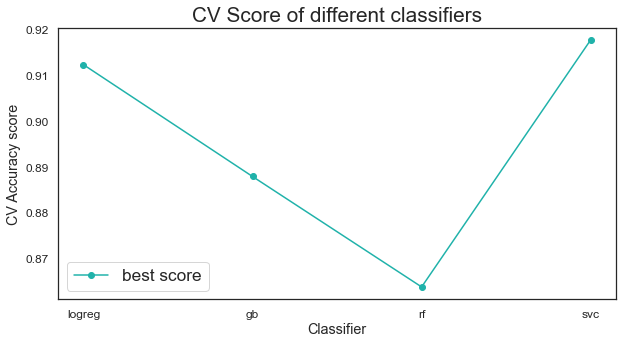

# Profound Sentence Classifier

    <a href="https://profoundornot.herokuapp.com/">Try the APP</a>
 

## Problem Statement

It may seem easy for a human to tell a profound statement from a mundane/shallow one, but what really makes a statement profound? For this project, I seek to answer 3 questions:

1. Is there a **pattern** to profound sentence?

2. Can we develop a **subreddit classifier** to classify statements from r/oneliners (for mundane/shallow statements) vs r/quotes (for profound statements)?

3. Can the classifier **generalize** to identify any profound statement?

By answering these 3 questions, I hope that it will enhance our understanding of this deeper end of the human ingenuity and offer some insights to what makes a statement profound/important. For a future application, it could even help us in filtering a long text to extract the important and profound information.

## Dataset

A total of **52197** posts were collected from r/oneliners and r/quotes:

**Class 0: r/oneliners**
- 22,479 posts
- r/oneliner is a collection of succinct, funny or witty remark. The statement should fit into one sentence.
- We take these quotes to be the anti-thesis of a profound quote, which means they are usually mundane, shallow and trivial (although they can be really funny)

**Class1: r/quotes**
- 29,718 posts
- r/quotes is subreddit of a collection of current quotes, historic quotes, movie quotes, song lyric quotes, game quotes, book quotes, tv quotes or any gem of wisdom.
- We take these quotes to be profound quotes

***Note***

1. To ensure consistency, care was taken to only extract posts which are only one line statements. Otherwise, posts from r/quotes may contain quotes that consists of multiple sentences.

2. To ensure generalizability, only the statement itself was used for our analysis and modelling. Other features such as post self texts, comments, upvotes, etc were not taken into consideration

From the post titles collected, we engineered additional features: 

- Title Length
- Average Word Length
- Longest Word Length
- Dale-Chall Readability Score
- Flesch–Kincaid Reading Ease
- Sentiment Score (VADER)
- Part of Speech (POS) Tagging

## Model Evaluation

Using a subset of our features: 

Our model achived a cross validation accuracy score of **0.92** on the training data and a score of **0.93** on the test data using the Support Vector Classifier (SVC) 

## Conclusion

Let us answer the 3 questions

**Is there a pattern to profound sentence?**

* Yes, by looking at features like common words, sentence length, word length and word tags, we do see some differences between profound quotes and not so profound sentences. Generally profound quotes tend to have more profound topics such as life and love. They tend to be longer and contain word tags that tend to increase sentence complexity.*

 

Common words from r/quotes shows that love and life are common themes.

 

r/quotes has longer sentence length

 

As well as more commas.

 

Sentences from r/quotes also generally use language which increase sentence complexity, while r/oneliners use language which are less formal.

**Can we develop a subreddit classifier to classify statements from r/oneliners vs r/quotes?**
* Yes, the classifier did rather well in terms of classifying subreddits, achieveing a training score of almost 0.93.*

**Can the classifier generalize to identify any profound statement?**
* Yes, to texts which are obviously not so profound, as seen from our prediction of boring tweets, misclassifying only 3 of 131 tweets (0.98 accuracy). However, it can can be quite easily fooled by a human from our tests.*

## Future developments

**1. Cleaner data** - Some sentences from r/oneliners can be profound, while the inverse if true for r/quotes. Future datasets can be more thoroughly labelled to ensure that the data within a class is more homogenous. However, this could require human supervision. 

**2. Word corpus** - a corpus of profound terms or shallow words/internet slangs as reference for our classifier, for example, we could have a feature which is a percentage of words in the sentence which belongs to the corpus.

**3. Contextual analysis** – Profoundness also depends a lot on context, our model mainly predicts base on word frequency, which does not take into account of context. In the future, contextual analysis methods can be explored. 
